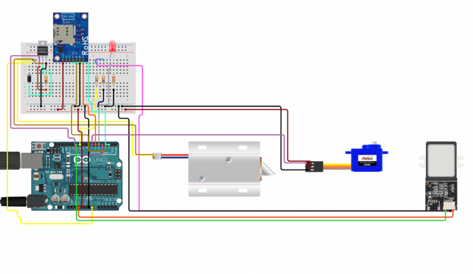
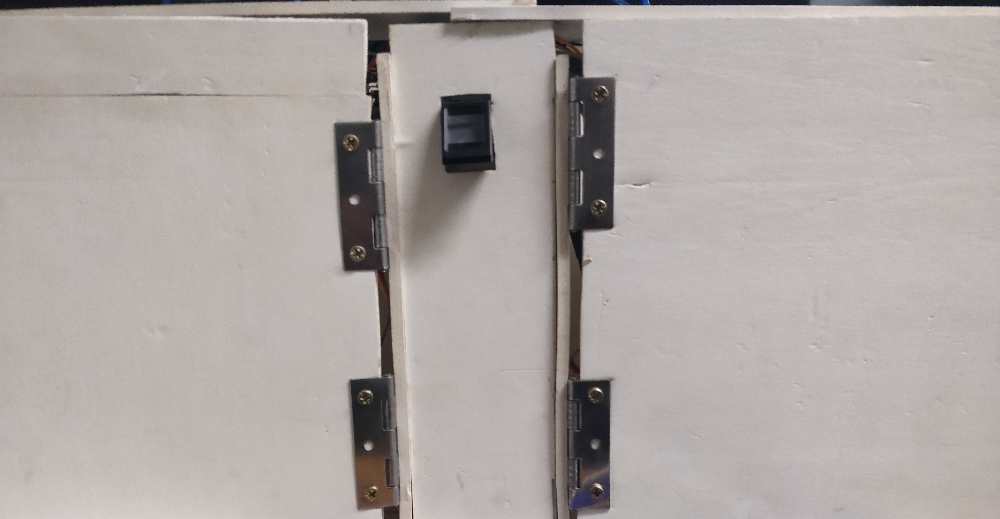
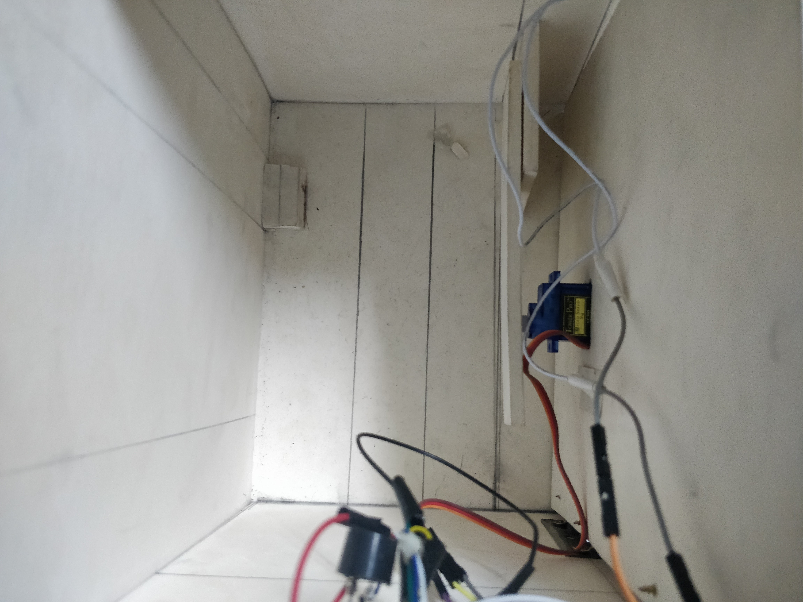

# Smart Almirah with Fingerprint and Digital locker
Security of valuables is as paramount as their acquisition. In this present day when armed robbery has gotten more sophisticated particularly in developing countries, there is the need for tighter security means, and one of the most secured technologies that can be employed is biometrics, finger print door lock to be precise. This project includes a smart and affordable Almirah door lock enhanced with a fingerprint interface. The fingerprint sensor will be integrated in the Almirah’s door panel. The fingerprint sensor will take the fingerprint of the user and forward it to the microcontroller to match with its records. If the print matches with one of the fingerprints of the microcontroller’s memory, the microcontroller will lock or unlock the door of Almirah. If the fingerprint is not matched to the microcontroller, the buzzer will buzz and the user will have to try again.

## 	PROPOSED MODEL

### A. Components

 We used ArduinoUno which is an open-source microcontroller board based on the Microchip At
Mega 328P Microcontroller. The board is equipped with sets of digital and analog input output (I/O) pins that may be interfaced to various expansion boards. The board has 14 digital I/O pins (six capable of PWM output), 6 analog I/O pins, and is programmable with the ArduinoUno IDE (Integrated Environment), via a type B USB cable. It can be powered by the USB cable or by an external 9-volt battery, though it accepts voltages between 7 and 20 volts. pins 0 (RX) and 1 (TX). Used to receive (RX) and transmit (TX) TTL serial data. These pins are connected to the corresponding pins of the AT mega 8U2 USB-to-TTL serial chip. We also fingerprint scanner which performs a very basic function. It takes an image of human fingertip and compares it against the data of a previously scanned fingerprint. If the two match, then security is granted.
GSM (Global System for Mobile communication) is a digital mobile network that is widely used by mobile phone users in Europe and other parts of the world [8]. In our project we used GSM that is a variation of time division multiple access and is the most widely used of the three digital wireless telephony technologies: TDMA, GSM and code-division multiple access. GSM digitizes and compresses data, then sends it down a channel with two other streams of user data, each in its own time slot. We used a Magnetic Door Switch Set which is a small reed switch assembly. Specifically, it is designed to an alert to alert when doors of any of the Almirah’s aperture open. These types of switches are primarily used in home security systems. One half of the assembly set on a door frame and the other attached to the door itself. We also used a buzzer while some intruder wants to open the door of the Almirah. It is an alert for us to become more conscious.

### B. Circuit Details

Here, in this circuit diagram we showed the whole planned circuit of our project. The input section contains Fingerprint Sensor only. For the output section we have used Servo Motor and GSM. Fingerprint Sensor is able to keep 18 different types of input. When the Fingerprint will match with previously inputted fingerprint in database, Left Servo and Right Servo motor will rotate 0 and 95 degrees accordingly to unlock the door. We kept the Right Servo and Left Servo 0 and 95 degrees accordingly in initial phase to keep the door locked. When there will be five times incorrect fingerprint input, the system will text a message to the user through GSM. We have used alignment Sensor to make our system more secure. For this we are using Magnetic Door Switch Set which gives high output if two pieces are attached together and Low output if those are not attached. When the door is locked it gives High output. If the door is opened without matched fingerprint, the system will send the message to the user so that the user can take action against it.

### C. Hardware Implementation

For hardware implementation, we have made a box of three containers. There is two compartments for customer’s usage and remained middle space is for keeping our components. Arduino’s are kept along with GSM and Buzzer in that middle space. The fingerprint sensor is kept in front side as users can give their fingerprint easily. One side of Magnetic Door Switch Set is connected with the box in two corners and other side is connected with the door so that user can open the door without any hassle

### D.	Working Process Of The Model

We kept our prototype straightforward. At first, the user will give his/her fingerprint and system will match it with database. If the fingerprint mismatched, the bugger will make noise. Otherwise it will unlock the door according to the individual’s matched fingerprints portion. To lock the door back, user need to give their finger again. If anyone tries with wrong fingerprint five times, the system will notify the user through a message in their mobile. If any intruder or robber tries to break the lock or try to open the door without correct fingerprint, then the system will notify the user so that the user can take action immediately. The user can keep eighteen fingerprints in database to open the door. With correct fingerprint one user can not open others door in our prototype.

## EXPERIMENTAL ANALYSIS

The experimental analysis has been done in three steps.   Input shows the inputs of the system and the security process, system test is to show how effectively users can pick up or hold an object.

### A.	Inputs

For one side we use two fingerprints. So for two portions we used four finger print. Alignment is used to check whether the door is open or off.   In status of door, we used HIGH for lock and LOW for unlock. The system will check alignment (during lock alignment will be 0 and when it is open it will be 1) and door status. If alignment gives HIGH output during door status HIGH (lock status) for 5 times it will send notification. We have used GSM module for sending message to the user. Whether the door is open or off.   In status of door, we used HIGH for lock and LOW for unlock. The system will check alignment (during lock alignment will be 0 and when it is open it will be 1) and door status. If alignment gives HIGH output during door status HIGH (lock status) for 5 times it will send notification. We have used GSM module for sending message to the user.

### B.	System Test 

Servo motor use to lock and open the door , maximum move 95 degrees  . A fingerprint scanner is a type of technology that identifies and authenticates the fingerprints of an individual. We use here 3 Arduino for taking input, giving output.  A buck converter (step-down converter) is a DC-to-DC power converter which steps down voltage (while stepping up current) from its input (supply) to its output (load). For developing IOT we use SIM900A module.

### C.	Limitations of the system

Though the whole system has reached the goal it has some limitations. First of all, in our system if human’s skin rises then the fingerprint scanner will not work as it will not detect the accurate person.  Besides if someone holds the fingerprint scanner in wet hand it will not identify the person. Though these are some lacking of our system they are essential as they are helping us to identify valid human who have fingerprint input in the fingerprint scanner.

### D.	Future Work:

We have many innovative ideas with this system. Due to lack of time we could not work out with a plan that is all clothes will displayed in a screen so that we can easily choose our dress without opening the door of the Almirah. It will be more time effective. We also want to work with knowing number of dress without opening the Almirah. So if we get any sponsorship we an enhanced our system in large sector.
